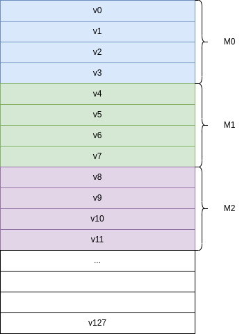

= AISoC RISC-V "X" Vector Extension
Version 0.1-draft
:doctype: article
:encoding: utf-8
:lang: en
:toc: left
:numbered:
:stem: latexmatch
:le: &#8804;
:ge: &#8805;
:ne: &#8800;
:approx: &#8776;
:inf: &#8734;

Contributors include: Hung Yan Tai.

:sectnums!:

== Introduction

This document is verison 0.1-draft of the AISoC RISC-V Matrix extension.
And, this document is essentially extended from the vector extension.

== Implementation-defined Constant Parameters

In AISoC, the hart supporting a matrix extension defines two parameters:

. _ELEN_: The maximum size in bits of a vector element that any operation can produce or consume, _ELEN_ {ge} 8, which must be power of 2. (Reference from riscv-v-spec-v1.0)
. _VLEN_: The number of bits in a single vector register, _VLEN_ {ge} ELEN, which must be power of 2, and must be no greater than 2^16^.
. _MLEN_: The number of bits in matrix register, _MLEN_ {ge} _VLEN_, which must be power of 2, and must be no greater than 2^16^.

== Matrix Extension Programmer's Model

The matrix extension adds 128 vector registers to form a up to 16x16 matrix with ELEN = 8. 

.Matrix Registers
[cols="^1"]
[width=75%]
|===
| v0
| v1
| v2
| v3
| v4
| v5
| v6
| v7
| v8
| v9
| ...
| v126
| v127
|===

And a matrix is just a consecutive number of vector register. 128 number of vector registers can be grouped with 4 and named a Mn with the moduler of 4. The smallest matrix register is {v0, v1, v2, v3} = M0.

And by describing the matrix, such as 3xVL matrix, it can be
M0 with a offset to specify the number of trailing vector register
on the matrix registers. Formally, to describe a matrix with 3 parameters.

. _Offset_: Specify the last valid vector register in a matrix register.
. _VL_: It is the same as vector extension.
. _MG_: Matrix Group, it is the matrix group that can spcify the number of group of matrix.

=== Matrix Example

Basically, the format is a follows

M0, _offset_, _VL_, _MG_

----
Example M0, 3, VL, 1

M0 = V0 | 0 - (VL-1)
     V1 | 0 - (VL-1)
     V2 | 0 - (VL-1)
     V3 | invalid
----

----
Example M2, 1, VL, 2

M2 = V8  |  0 - (VL-1)    
     V9  |  0 - (VL-1)    
     V10 |  0 - (VL-1)        
     V11 |  0 - (VL-1)        
     V12 |  0 - (VL-1)        
     V13 |  invalid        
     V14 |  invalid        
     V15 |  invalid        
----

----
Example M2, 2, VL, 2

M2 = V8  |  0 - (VL-1)    
     V9  |  0 - (VL-1)    
     V10 |  0 - (VL-1)        
     V11 |  0 - (VL-1)        
     V12 |  0 - (VL-1)        
     V13 |  0 - (VL-1)        
     V14 |  invalid        
     V15 |  invalid        
----

== Matrix Instruction Type

